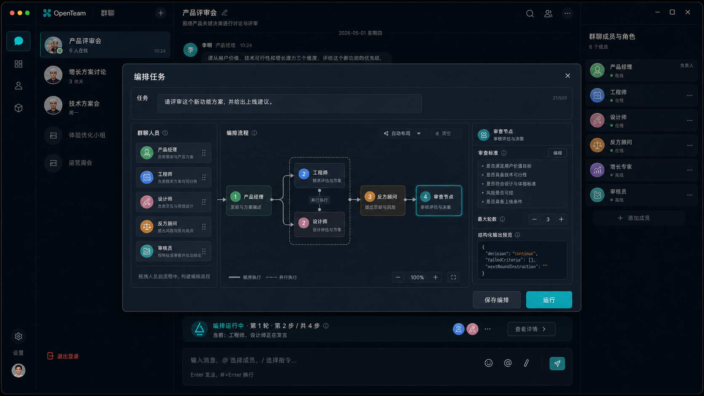

# OpenTeam Agent 编排模式 PRD

## 0. 设计概念图



这张设计概念图用于表达编排模式的第一版界面方向：在当前 OpenTeam 群聊工作台上打开“编排任务”弹窗，用户可以先输入任务，再把群聊人员拖入流程画布，配置线性步骤、并行发言步骤和审查节点，最后点击运行。图中重点体现任务输入、人员列表、编排流程、审查标准、结构化审查输出预览和运行状态。

## 1. 背景

OpenTeam 当前已经支持在一个群聊中添加多个 AI 人员，并将用户消息投递给多个人员并行回复。这个机制验证了多 AI 群聊的基础能力，但默认“用户不 @ 时全员回复”的体验会让群聊变得嘈杂，也不符合真实群聊心智。

用户希望 OpenTeam 从“多人并行回复工具”进一步升级为“AI 协作流程工作台”。用户不仅能点名某些 AI 回复，还能把 AI 编排成一个明确的协作流程，例如：

```text
产品经理先分析
  ↓
工程师、设计师并行补充
  ↓
反方顾问提出质疑
  ↓
审查节点判断是否通过
  ↓
未通过则进入下一轮
```

本 PRD 定义 OpenTeam 的 Agent 编排模式，包括用户旅程、普通群聊触发规则、编排画布、流程运行、上下文传递、审查节点、轮询机制和验收标准。

## 2. 产品目标

### 2.1 核心目标

- 让 OpenTeam 支持可视化 Agent 协作编排。
- 让用户可以通过拖动和连线定义 AI 发言顺序、并行阶段和审查节点。
- 让后续 AI 发言能够理解前置 AI 的发言，形成真正的协作链路。
- 让审查节点通过结构化 JSON 输出控制流程是否进入下一轮。
- 改造普通群聊消息触发机制，避免用户每次发言都默认触发所有 AI。
- 保持流程可控、可解释、可暂停、可重试、可终止。

### 2.2 非目标

第一版不做：

- 完全自由的通用工作流引擎。
- 任意条件分支和任意节点跳转。
- 无限轮询。
- AI 自动创建或修改编排图。
- 跨群聊复用编排模板。
- 云端同步或多人协同编辑编排。
- 复杂模型参数配置。

### 2.3 第一版交付范围

第一版重点做“会议流程编排”，而不是完整 DAG 工作流：

- 支持编排模式入口。
- 支持在编排弹窗中输入任务。
- 支持拖动人员形成多个执行步骤。
- 每个步骤可包含一个或多个人员。
- 同一步骤内人员并行发言。
- 下一步骤等待上一步骤全部完成后启动。
- 支持审查节点。
- 审查节点输出结构化 JSON，系统据此判断通过、继续下一轮或终止。
- 支持最大轮数。
- 运行结果进入当前群聊消息流。
- 普通群聊中，用户不 @ 时只记录消息，不触发 AI 回复。

## 3. 核心产品原则

### 3.1 用户明确触发 AI

普通群聊中，用户发言不应默认触发所有 AI。AI 只有在以下场景被触发：

- 用户 @ 某个 AI。
- 用户 @ 多个 AI。
- 用户 @ 所有人。
- 用户运行一个编排任务。

这让群聊更像真实会议：用户可以自由补充背景、记录想法、整理上下文，而不会每句话都引发全员回复。

### 3.2 编排是任务运行，不只是配置

编排模式不是一个独立设置页，而是一次协作任务的准备和运行入口。用户进入编排模式后，首先输入任务，然后编排 AI 的协作流程，最后点击运行。

### 3.3 流程优先可控

编排流程必须可解释、可恢复、可停止。系统应明确展示：

- 当前第几轮。
- 当前执行到第几步。
- 哪些人员正在发言。
- 哪些步骤已完成。
- 哪些节点失败或等待处理。

### 3.4 代码守边界，模型做判断

审查节点可以由模型判断质量是否达标，但系统必须控制流程边界：

- 最大轮数由系统强制执行。
- 审查 JSON 必须被校验。
- 非法 JSON 不应直接驱动流程。
- 即使审查节点要求继续，达到最大轮数后也必须结束。

## 4. 用户旅程

### 4.1 创建群聊

用户创建一个群聊，例如：

```text
产品方案评审会
```

然后添加多个 AI 人员：

```text
产品经理
工程师
设计师
反方顾问
审核员
```

进入群聊后，默认是普通群聊界面，包含消息区、输入框、人员列表和协作模式入口。

### 4.2 普通群聊发言

普通群聊的新规则：

```text
用户不 @：只发送为普通用户消息，不触发任何 AI
用户 @产品经理：只有产品经理回复
用户 @工程师 @设计师：工程师和设计师并行回复
用户 @所有人：所有 AI 并行回复
```

输入框提示文案建议从：

```text
直接发送只记录消息；@ 人员后触发回复
```

调整为：

```text
直接发送只记录消息；@ 人员后触发回复
```

当用户输入了 @，发送预览显示：

```text
将发送给：工程师、设计师
```

当用户未输入 @，发送预览显示：

```text
将作为群消息记录，不触发 AI
```

```text
将作为群消息记录，不触发 AI
```

### 4.3 进入编排模式

群聊顶部提供协作模式入口：

```text
协作模式：普通 / 编排
```

用户点击“编排”后，打开编排弹窗或大抽屉。该界面包含：

- 任务输入区。
- 当前群聊人员列表。
- 编排画布。
- 运行设置。
- 保存和运行按钮。

示例：

```text
任务
[ 请评审这个新功能方案，并给出是否值得上线的建议。 ]

编排流程
产品经理 -> 工程师 + 设计师 -> 反方顾问 -> 审查节点

运行设置
最大轮数：3
未通过时：进入下一轮

[保存编排] [运行]
```

### 4.4 编排 AI

用户可以把群聊人员拖到画布中，形成步骤。

第一版建议采用“阶段式编排”：

```text
第 1 步：产品经理
第 2 步：工程师 + 设计师
第 3 步：反方顾问
第 4 步：审查节点
```

在视觉上可以表现为连线：

```text
产品经理 -> 工程师 + 设计师 -> 反方顾问 -> 审查节点
```

规则：

- 一个步骤可以有一个人员。
- 一个步骤可以有多个人员。
- 同一步骤内人员并行发言。
- 下一步骤必须等待上一整个步骤完成。
- 后续步骤能看到前置步骤的发言。
- 并行步骤内部的人员默认不互相等待，也不互相看到同一步骤内其他人的实时回复。

### 4.5 运行编排

用户点击运行后，系统在群聊中创建一条编排任务消息：

```text
你发起了编排任务：
请评审这个新功能方案，并给出是否值得上线的建议。
```

随后流程开始执行：

```text
产品经理：
我先从用户价值和目标场景分析……

工程师：
基于前面的产品判断，我补充技术实现成本……

设计师：
从体验路径看，我认为需要注意……

反方顾问：
我不同意前面方案里的几个假设……

审查节点：
审查结果：继续下一轮
未通过项：上线计划不够具体，缺少回滚策略
下一轮重点：请补充灰度发布、监控和回滚方案。
```

所有结果都进入当前群聊消息记录。用户可以关闭编排弹窗，在群聊中观看运行过程。

### 4.6 运行中状态

群聊顶部或消息流中显示编排状态：

```text
编排运行中 · 第 1 轮 · 第 2 步 / 共 4 步
当前：工程师、设计师正在发言
等待：反方顾问、审查节点
```

运行中操作：

- 暂停：当前步骤完成后暂停，不进入下一步。
- 继续：从暂停位置继续执行。
- 停止：终止整个编排任务。
- 重试：对失败人员或失败节点重试。
- 跳过：跳过当前失败人员或当前步骤。

第一版至少需要支持：

- 停止。
- 重试失败人员。
- 跳过失败人员或步骤。

### 4.7 编排结束后

流程结束后，群聊中出现系统状态：

```text
编排已完成 · 共 2 轮 · 5 位人员参与
```

用户可以继续在群聊中输入消息。

结束后的普通消息仍遵循新规则：

```text
不 @：只记录消息
@某人：触发该人员
@多人：触发多人并行回复
@所有人：触发全员并行回复
再次点击编排：发起新的编排任务
```

## 5. 编排模式概念模型

### 5.1 编排流程

第一版底层可以采用步骤数组，而不是完全自由 DAG：

```ts
interface OrchestrationFlow {
  id: string
  chatId: string
  name?: string
  steps: OrchestrationStep[]
  maxRounds: number
  reviewPolicy?: ReviewPolicy
  createdAt: number
  updatedAt: number
}
```

### 5.2 编排步骤

```ts
type OrchestrationStepType = 'role' | 'review'

interface OrchestrationStep {
  id: string
  type: OrchestrationStepType
  roleIds: string[]
  name?: string
}
```

规则：

- `type: 'role'` 表示普通发言步骤。
- `roleIds.length === 1` 表示单人发言。
- `roleIds.length > 1` 表示多人并行发言。
- `type: 'review'` 表示审查节点。
- 审查节点可以绑定一个审核员角色，也可以使用系统默认审查员。

### 5.3 编排运行

每次点击运行，创建一个运行实例：

```ts
interface OrchestrationRun {
  id: string
  chatId: string
  flowId: string
  taskMessageId: string
  status: 'running' | 'paused' | 'completed' | 'stopped' | 'error'
  currentRound: number
  maxRounds: number
  currentStepIndex: number
  stepResults: OrchestrationStepResult[]
  reviewResults: ReviewResult[]
  createdAt: number
  updatedAt: number
}
```

运行实例用于恢复、展示进度和处理失败。

## 6. 上下文传递规则

### 6.1 普通步骤上下文

每个发言人员收到的 prompt 应包含：

- 用户原始任务。
- 当前轮次。
- 当前流程说明。
- 前置步骤的发言。
- 历史轮次摘要或上一轮审查意见。
- 自己的角色身份和人设。

例如工程师在第 2 步收到：

```text
用户任务：
请评审这个新功能方案，并给出是否值得上线的建议。

前置发言：
产品经理：……

你是工程师。请基于用户任务和前置发言，从技术实现、风险和上线成本角度补充。
```

### 6.2 并行步骤上下文

同一步骤中多个 AI 并行发言时：

- 它们都看到相同的前置上下文。
- 它们不等待同一步骤中其他 AI。
- 它们默认看不到同一步骤中其他 AI 的实时结果。
- 下一步骤可以看到该并行步骤所有 AI 的结果。

### 6.3 下一轮上下文

如果审查节点决定进入下一轮，下一轮 prompt 应包含：

- 用户原始任务。
- 前几轮关键结果。
- 上一轮审查结论。
- `nextRoundInstruction`。

这样下一轮不是重复回答，而是带着审查意见迭代。

## 7. 审查节点

### 7.1 审查节点定位

审查节点是编排流程中的特殊节点。它不是普通发言节点，而是流程控制节点。

审查节点负责：

- 根据用户配置的审查标准检查本轮结果。
- 输出给用户看的审查意见。
- 输出给系统看的结构化 JSON。
- 决定流程通过、继续下一轮或终止。

### 7.2 审查节点输入

审查节点接收：

- 用户原始任务。
- 当前轮所有人员发言。
- 历史轮次摘要。
- 用户配置的审查标准。
- 当前轮数。
- 最大轮数。

### 7.3 审查标准

审查标准由用户用自然语言填写。

示例：

```text
必须包含目标用户、用户价值、实现成本、主要风险、上线计划。
如果缺少上线计划或风险应对，就进入下一轮。
```

系统可以提供预设模板：

```text
方案评审：
- 是否说明用户价值
- 是否说明实现成本
- 是否说明主要风险
- 是否给出上线建议

内容产出：
- 是否符合目标读者
- 是否结构清晰
- 是否有足够细节
- 是否可以直接发布

技术方案：
- 是否说明架构选择
- 是否覆盖边界情况
- 是否说明测试方案
- 是否指出潜在风险
```

### 7.4 审查 JSON

审查节点必须输出合法 JSON。第一版字段建议：

```json
{
  "decision": "pass",
  "reason": "本轮结果已经覆盖用户价值、技术风险和上线计划。",
  "failedCriteria": [],
  "nextRoundInstruction": ""
}
```

未通过示例：

```json
{
  "decision": "continue",
  "reason": "方案已经覆盖用户价值和主要风险，但上线计划不够具体。",
  "failedCriteria": ["缺少灰度发布计划", "缺少失败回滚方案"],
  "nextRoundInstruction": "下一轮请重点补充灰度发布、监控指标和回滚策略。"
}
```

终止示例：

```json
{
  "decision": "stop",
  "reason": "当前信息不足，无法继续有效评审，需要用户补充目标用户和业务约束。",
  "failedCriteria": ["任务背景不足"],
  "nextRoundInstruction": ""
}
```

字段说明：

- `decision`：必填，只能是 `pass`、`continue`、`stop`。
- `reason`：必填，说明判断理由。
- `failedCriteria`：必填数组，列出未通过项。
- `nextRoundInstruction`：当 `decision` 为 `continue` 时必填。

### 7.5 系统决策规则

系统解析审查 JSON 后执行：

```text
decision = pass：
  编排完成

decision = continue：
  如果 currentRound < maxRounds，进入下一轮
  如果 currentRound >= maxRounds，结束流程并提示达到最大轮数

decision = stop：
  终止流程
```

如果审查 JSON 非法：

- 将审查节点标记为失败。
- 展示解析失败原因。
- 用户可选择重试审查节点、手动结束或跳过审查。

## 8. 轮询机制

### 8.1 最大轮数

所有循环都必须有最大轮数。

默认建议：

```text
最大轮数：1
可选：2 / 3 / 自定义
```

第一版可以限制最大值，例如最多 5 轮。

### 8.2 下一轮启动

进入下一轮时，流程从第一个普通步骤重新开始。

默认不支持审查节点跳转到任意节点。也就是说第一版采用：

```text
未通过 -> 从流程开头重新跑一轮
```

而不是：

```text
未通过 -> 只让工程师再说一次
```

后续版本可以支持局部重跑。

### 8.3 达到最大轮数

如果达到最大轮数仍未通过，流程结束，群聊显示：

```text
编排已结束 · 达到最大轮数
仍未通过项：
- 上线计划不够具体
- 缺少回滚方案
```

此时用户可以：

- 人工继续追问某个 AI。
- 修改审查标准后重新运行。
- 调整编排流程后再次运行。

## 9. 失败处理

### 9.1 发送失败

如果某个 AI 发送失败：

```text
工程师发送失败
原因：人员 iframe 尚未就绪

[重试] [跳过工程师] [停止流程]
```

系统不应静默跳过失败节点。

### 9.2 回复超时

如果某个人员长时间未回复：

```text
设计师回复超时

[继续等待] [重试] [跳过设计师] [停止流程]
```

### 9.3 并行步骤部分失败

同一步骤中如果多个 AI 并行，部分失败时：

- 已成功的结果保留。
- 失败人员标记为失败。
- 下一步骤默认不启动，等待用户处理。
- 用户可以选择重试失败人员、跳过失败人员或停止流程。

### 9.4 审查失败

审查失败包括：

- 审查员发送失败。
- 审查员回复为空。
- JSON 解析失败。
- JSON 字段不合法。

处理方式：

```text
审查节点失败
原因：审查结果不是合法 JSON

[重试审查] [手动通过] [停止流程]
```

第一版可先不提供“手动通过”，只提供重试和停止。

## 10. UI 需求

### 10.1 协作模式入口

群聊顶部展示：

```text
协作模式：普通 / 编排
```

也可以做成按钮：

```text
[编排任务]
```

点击后打开编排弹窗。

### 10.2 编排弹窗

编排弹窗包含：

- 顶部任务输入区。
- 左侧人员列表。
- 中间编排画布。
- 右侧节点配置面板。
- 底部运行设置和操作按钮。

布局示例：

```text
┌────────────────────────────────────────────┐
│ 任务                                       │
│ [ 请评审这个新功能方案…… ]                 │
├──────────┬───────────────────┬─────────────┤
│ 人员     │ 编排画布           │ 节点设置    │
│ 产品经理 │ 产品经理           │ 审查标准    │
│ 工程师   │   ↓               │ 最大轮数    │
│ 设计师   │ 工程师 + 设计师    │             │
│ 审核员   │   ↓               │             │
│          │ 审查节点           │             │
├──────────┴───────────────────┴─────────────┤
│ 最大轮数：3                  [保存] [运行] │
└────────────────────────────────────────────┘
```

### 10.3 画布交互

编排画布建议使用 AntV X6 实现。

选型理由：

- X6 是 MIT 协议。
- X6 是 TypeScript 友好的图编辑引擎，适合流程图、DAG 和节点连线场景。
- X6 不要求引入 React，符合当前 OpenTeam 的 Vite + TypeScript + 原生 DOM 架构。
- X6 支持节点拖拽、边连接、端口、缩放、平移、选择、键盘删除、Dnd 插件等流程图编辑能力。
- 相比 SortableJS，X6 更贴合用户对“拖动节点并连线编排 Agent”的心智。
- 相比 React Flow / dnd-kit，X6 不需要为了画布引入 React 运行时。

第一版交互建议：

- 从人员列表拖拽人员到画布，创建一个步骤。
- 将人员拖到已有步骤中，形成并行步骤。
- 支持步骤上移、下移。
- 支持从步骤中移除人员。
- 支持添加审查节点。
- 支持点击节点配置审查标准。

视觉上可以用连线表达先后关系，但底层仍保持步骤数组。

### 10.4 群聊消息展示

编排任务消息：

```text
你发起了编排任务
任务：……
流程：产品经理 -> 工程师 + 设计师 -> 审查节点
```

普通人员回复可以标注编排位置：

```text
产品经理 · 第 1 轮 · 第 1 步
……
```

审查节点消息：

```text
审查节点 · 第 1 轮
结论：继续下一轮
原因：……
下一轮重点：……
```

流程结束消息：

```text
编排已完成
轮数：2 / 3
结论：通过
```

## 11. 消息触发规则调整

### 11.1 当前问题

当前普通群聊中，用户不 @ 任何人时，系统默认投递给全员。这导致：

- 用户无法只记录一条普通消息。
- 群聊容易过度响应。
- 用户控制感弱。
- 成本更高。
- 编排模式价值不突出。

### 11.2 新规则

普通发送规则调整为：

```text
无 @：创建用户消息，不触发 AI
@单人：投递给单人
@多人：投递给多人
@所有人：投递给全员
```

### 11.3 空投递消息

无 @ 消息仍然进入消息流，作为上下文记录。

这类消息：

- `targetRoleIds` 为空数组或缺省。
- `deliveryStatus` 为空或缺省。
- `status` 可直接为 `received`。
- 不创建 prompt delivery。

后续 AI 被 @ 或运行编排时，可以看到这些用户消息作为群聊上下文。

## 12. 权限与边界

### 12.1 编排运行期间用户继续发言

用户可以继续发普通消息。

默认规则：

- 不 @：只记录消息，不影响当前编排。
- @ 人员：如果该人员正在编排中回复，提示等待或排队。
- 再次运行编排：第一版同一群聊同一时间只允许一个编排运行。

### 12.2 同一人员并发

同一个人员同一时间只能处理一个任务。

如果流程中再次轮到正在回复的人员：

- 等待其完成。
- 或提示当前人员忙碌。

第一版不支持同一人员并发处理多个 prompt。

### 12.3 多群聊并行

不同群聊可以各自运行编排，只要各自人员 iframe 独立。

## 13. 验收标准

### 13.1 普通群聊

- 用户不 @ 任何人员时，消息进入群聊，但不会触发 AI 回复。
- 用户 @ 单人时，仅该人员回复。
- 用户 @ 多人时，仅这些人员并行回复。
- 用户 @ 所有人时，全员并行回复。
- 输入框预览能准确说明是否会触发 AI。

### 13.2 编排创建

- 用户可以打开编排弹窗。
- 用户可以在编排弹窗顶部输入任务。
- 用户可以选择群聊人员组成步骤。
- 用户可以创建包含多人的并行步骤。
- 用户可以添加审查节点。
- 用户可以配置审查标准和最大轮数。

### 13.3 编排运行

- 点击运行后，群聊中出现编排任务消息。
- 第一步人员收到任务并回复。
- 第二步人员能看到第一步回复。
- 并行步骤中的人员同时启动。
- 后续步骤等待前置步骤全部完成。
- 所有人员回复进入群聊消息流。
- 运行状态能显示当前轮次和步骤。

### 13.4 审查节点

- 审查节点能收到用户任务、前置发言和审查标准。
- 审查节点输出 JSON。
- 系统能解析 `decision`。
- `pass` 时流程完成。
- `continue` 且未达到最大轮数时进入下一轮。
- `continue` 但达到最大轮数时流程结束。
- 非法 JSON 会进入可重试错误状态。

### 13.5 失败处理

- 普通人员发送失败时，流程暂停并提示重试、跳过或停止。
- 并行步骤部分失败时，不自动进入下一步。
- 审查节点失败时，用户可以重试或停止。
- 用户停止流程后，不再继续投递后续节点。

## 14. 后续演进

后续版本可以扩展：

- 真正自由 DAG 编排。
- 条件分支。
- 审查节点局部重跑指定步骤。
- 编排模板保存和复用。
- AI 推荐编排流程。
- 多个审查节点。
- 汇总节点。
- 人工审批节点。
- 编排运行报告导出。
- 成本和耗时预估。

## 15. 总结

Agent 编排模式将 OpenTeam 从“多个 AI 并行聊天”升级为“可控的 AI 协作流程”。第一版应重点保持规则简单：

```text
步骤从左到右执行
同一步骤并行
下一步骤等待上一步完成
审查节点输出 JSON
最大轮数强制兜底
普通群聊不 @ 不触发 AI
```

这个设计既符合用户对可视化编排的想象，也能避免第一版陷入通用工作流引擎的复杂度。
