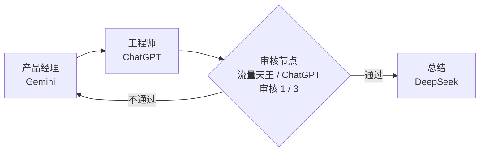

# Orchestration Floating Status Design

## Goal

把编排运行状态从群聊顶部状态条改成可拖动、可缩放、可收起的悬浮框。用户在聊天过程中可以持续看到编排执行到哪个节点、哪个角色正在执行、审核已经进行了几次，以及整个流程图上的当前位置。

## Product Semantics

编排运行仍然以保存的流程图为准：

- 普通节点完成后，只沿当前节点的出口连线继续。
- 审核节点返回 `pass` 时走继续线。
- 审核节点返回 `fail` 时，如果未达到最大审核次数，走不通过重试线。
- 审核节点返回 `fail` 且达到最大审核次数后，根据节点配置选择停止流程或继续往下走。
- 最大节点执行数是全局安全阀，统计执行节点和审核节点的总次数。

悬浮框不改变运行语义，只负责展示和操作当前编排。

## Floating Card Behavior

悬浮框默认出现在输入框右上方，位于聊天区域内。

展开态显示一个主浮层，不再同时显示底部小状态条。收起后主浮层消失，只显示一个小状态条，点击小状态条恢复展开。

主浮层支持：

- 拖动：顶部标题栏作为拖动手柄。
- 缩放：右下角 resize handle，限制最小和最大尺寸。
- 收起：标题栏右侧 `－` 按钮。
- 停止：运行中显示停止按钮。

位置、尺寸、收起状态属于本机 UI 偏好，不写入业务 store。建议用 `localStorage`，按 chatId 区分：

```text
openteam.orchestrationFloatingStatus.<chatId>
```

存储内容：

```ts
interface OrchestrationFloatingStatusPrefs {
  collapsed: boolean
  x: number
  y: number
  width: number
  height: number
}
```

拖动和缩放都要 clamp 到聊天区域内，避免用户把浮层拖出可视范围。

## Floating Card Content

展开态内容只围绕当前执行状态，不显示“上一节点”和“下一步”文字。

基础内容：

- 运行状态：编排运行中、已停止、出错、已完成。
- 已执行节点数：`4 / 50`。
- 当前节点序号：例如 `节点 3 / 4`。
- 当前节点：节点类型、角色名、站点。
- 当前动作：例如 `ChatGPT · 正在判断上线建议`。
- mini 流程图。
- 状态相关操作按钮。

当前节点是审核节点时额外显示：

- 审核次数：`审核次数 1 / 3`。
- 达到上限后的策略：`上限后：停止流程` 或 `上限后：继续往下走`。

普通执行节点不显示审核次数，避免信息噪音。

## Reference Diagrams

下面两张图是实现时的参考示意，不是最终像素稿。真正实现时可以按当前组件样式微调尺寸、间距和颜色，但信息结构和流程语义要保持一致。

### Flow Semantics



这张图表达的是运行语义：

- 普通节点只按用户连线推进。
- 审核节点 `pass` 走右侧通过线。
- 审核节点 `fail` 走下方不通过线，可以回到任意用户连接的前置节点。
- 审核节点达到最大审核次数后，再根据节点配置决定停止或继续。

### Floating Card Preview

下面的 SVG 是悬浮框里的 mini 流程图参考。它故意使用直线和直角折线，避免曲线绕线导致用户看不清。

<svg viewBox="0 0 640 300" width="100%" role="img" aria-label="编排悬浮框 mini 流程图参考">
  <defs>
    <marker id="orchestration-arrow" viewBox="0 0 10 10" refX="8" refY="5" markerWidth="5" markerHeight="5" orient="auto-start-reverse">
      <path d="M 0 0 L 10 5 L 0 10 z" fill="#7de6ea"></path>
    </marker>
    <filter id="orchestration-current-glow" x="-30%" y="-30%" width="160%" height="160%">
      <feGaussianBlur stdDeviation="4" result="blur"></feGaussianBlur>
      <feColorMatrix in="blur" type="matrix" values="0 0 0 0 0.49 0 0 0 0 0.9 0 0 0 0 0.92 0 0 0 0.45 0"></feColorMatrix>
      <feMerge>
        <feMergeNode></feMergeNode>
        <feMergeNode in="SourceGraphic"></feMergeNode>
      </feMerge>
    </filter>
  </defs>

  <rect x="0" y="0" width="640" height="300" rx="18" fill="#081521" stroke="rgba(125,230,234,.24)" stroke-width="1"></rect>

  <rect x="36" y="76" width="118" height="58" rx="14" fill="#122132" stroke="#5b7388" stroke-width="2"></rect>
  <text x="95" y="101" text-anchor="middle" fill="#eafcff" font-size="15" font-weight="800">产品经理</text>
  <text x="95" y="122" text-anchor="middle" fill="#92a5b2" font-size="12">Gemini</text>

  <rect x="222" y="76" width="118" height="58" rx="14" fill="#122132" stroke="#5b7388" stroke-width="2"></rect>
  <text x="281" y="101" text-anchor="middle" fill="#eafcff" font-size="15" font-weight="800">工程师</text>
  <text x="281" y="122" text-anchor="middle" fill="#92a5b2" font-size="12">ChatGPT</text>

  <polygon points="444,58 510,105 444,152 378,105" fill="#122132" stroke="#7de6ea" stroke-width="2.5" filter="url(#orchestration-current-glow)"></polygon>
  <text x="444" y="99" text-anchor="middle" fill="#eafcff" font-size="15" font-weight="800">审核</text>
  <text x="444" y="121" text-anchor="middle" fill="#92a5b2" font-size="12">1 / 3</text>

  <rect x="548" y="76" width="74" height="58" rx="14" fill="#0d1926" stroke="#5b7388" stroke-width="2"></rect>
  <text x="585" y="101" text-anchor="middle" fill="#8798a5" font-size="15" font-weight="800">总结</text>
  <text x="585" y="122" text-anchor="middle" fill="#657785" font-size="12">DeepSeek</text>

  <path d="M154 105 H222" stroke="#7de6ea" stroke-width="2.5" fill="none" marker-end="url(#orchestration-arrow)"></path>
  <path d="M340 105 H378" stroke="#7de6ea" stroke-width="2.5" fill="none" marker-end="url(#orchestration-arrow)"></path>
  <path d="M510 105 H548" stroke="#7de6ea" stroke-width="2.5" fill="none" marker-end="url(#orchestration-arrow)"></path>
  <text x="526" y="92" fill="#9fcfd0" font-size="12" font-weight="700">通过</text>

  <path d="M444 152 V224 H95 V138" stroke="#7de6ea" stroke-width="2.5" fill="none" marker-end="url(#orchestration-arrow)"></path>
  <rect x="226" y="211" width="58" height="24" rx="10" fill="#082224" stroke="rgba(125,230,234,.5)"></rect>
  <text x="255" y="228" text-anchor="middle" fill="#c9fbef" font-size="12" font-weight="800">不通过</text>
</svg>

悬浮框外层布局参考：

```text
┌──────────────────────────────────────┐
│ ⋮⋮ 编排运行中              －   停止 │
├──────────────────────────────────────┤
│ 4 / 50                         审核 │
│ 已执行节点数                         │
│                                      │
│ 当前节点                             │
│ 审核 · 流量天王                      │
│ ChatGPT · 正在判断上线建议           │
│ 审核次数 1 / 3   上限后：继续往下走  │
│                                      │
│ [ mini SVG 流程图，当前节点高亮 ]     │
└──────────────────────────────────────┘
```

收起态只显示一个小状态条，例如：

```text
编排运行中 · 审核 · 4 / 50
```

## Button States

不同运行状态展示不同操作。

运行中：

- 收起
- 停止

已停止：

- 继续
- 重新运行

出错：

- 重试节点
- 跳过节点
- 重新运行

已完成：

- 重新运行

按钮语义：

- 停止：暂停或中止当前 run，保留进度。
- 继续：从 stopped run 的当前位置继续执行，不重新跑已完成节点。
- 重新运行：创建新的 run，从流程起点重新执行。
- 重试节点：只重跑当前失败节点。
- 跳过节点：跳过当前失败节点并沿流程继续。

需要新增后台命令：

```ts
GROUP_ORCHESTRATION_RESUME
```

现有命令继续复用：

- `GROUP_ORCHESTRATION_STOP`
- `GROUP_ORCHESTRATION_RUN`
- `GROUP_ORCHESTRATION_RETRY_STAGE`
- `GROUP_ORCHESTRATION_SKIP_STAGE`

## Mini Flow Diagram

mini 流程图不使用 X6。编辑器继续用 X6，悬浮框使用只读 SVG。

原因：

- X6 适合编辑，不适合放进小浮层做只读状态展示。
- SVG 更轻、更稳定，不会和聊天区域的拖拽、滚轮、缩放交互冲突。
- SVG 样式更容易精确控制，可以确保线条直、节点清晰、当前节点高亮。

数据来源仍然是 X6 保存下来的流程数据：

```ts
flow.graph.stageNodes
flow.graph.edges
stage.position
edge.vertices
```

SVG 渲染步骤：

1. 读取节点、边、当前 run。
2. 根据所有节点位置和 edge vertices 计算 bounding box。
3. 把流程图坐标归一化到浮层 mini 图区域。
4. 普通节点渲染为圆角矩形。
5. 审核节点渲染为菱形。
6. 已执行节点使用正常亮色。
7. 当前节点高亮。
8. 未执行节点弱化。
9. 出错节点使用错误态。
10. 审核节点当前执行时，在菱形里显示审核次数，例如 `1/3`。

实时高亮通过 store 更新触发重新 render。编排推进、节点完成、审核次数变化、出错、停止、继续，都会重新计算并更新 SVG。

## SVG Edge Rendering

线条必须是直线或直角折线，不使用曲线。

普通连线：

- 从源节点右侧到目标节点左侧。
- 同一水平线上使用直线。
- 不同高度使用直角折线。

审核通过线：

- 从审核菱形右侧出去，向右连接后续节点。
- 文案标签为 `通过`，可以弱化显示。

审核不通过线：

- 从审核菱形下方出去。
- 走到底部通道。
- 使用直角折线回到前置目标节点左侧或上方。
- 文案标签为 `不通过`。

如果 edge 保存了 `vertices`，SVG 优先使用保存的拐点。没有 `vertices` 时，按上述规则自动生成干净的直角路径。

## X6 Editor Changes

为保证编辑器、保存数据、悬浮框预览一致，需要补强 X6 编辑器。

现状：

- `stage.position` 已存在。
- `edge.vertices` 已存在。
- 保存/回显流程已经读取 `flow.graph.stageNodes` 和 `flow.graph.edges`。
- 整理画布会生成节点 position 和审核 fail 的回流 vertices。

需要补强：

- 监听节点拖动位置变化，写回 draft 中的 `stage.position`。
- 继续保存用户拖动线条后生成的 `edge.vertices`。
- 把 X6 连接线从 `smooth` 调整为直线或直角折线风格。
- “整理”按钮生成更规整的布局：
  - 主流程从左到右。
  - 审核节点为菱形。
  - `pass` 线向右。
  - `fail` 线走下方回流。

这样用户保存后再打开，节点位置和线条拐点都能稳定回显。

## Resume Semantics

停止后继续执行需要保留足够状态。

推荐规则：

- 停止运行中节点：把当前 running stageRun 标记为 stopped/skipped 之前，需要保留可恢复目标。
- 继续时优先恢复停止时的 running 节点。
- 如果停止发生在节点完成后但尚未推进，继续后沿后续连线推进。
- 如果 run 已完成，不显示继续按钮。

实现上可以在 run 中增加可选字段：

```ts
resumeStageIndex?: number
resumeStageId?: string
```

如果不新增字段，也可以从最后一个 `stageRun` 推导，但显式字段更稳。

## Error And Empty States

无 active run：

- 不显示悬浮框。

运行中：

- 显示当前节点和 mini 图。

已停止：

- 显示停止状态、当前位置、继续/重新运行。

出错：

- 当前错误节点高亮。
- 显示错误原因。
- 显示重试节点、跳过节点、重新运行。

已完成：

- 可短暂显示完成状态。
- 显示重新运行。
- 用户收起或切换聊天后可以隐藏。

## Acceptance Criteria

- 编排状态不再占用群聊顶部固定区域。
- 悬浮框默认出现在输入框右上方。
- 展开态和收起态不会同时显示。
- 用户可以拖动悬浮框。
- 用户可以缩放悬浮框。
- 用户可以收起和恢复悬浮框。
- 当前执行节点、角色、站点显示清楚。
- 审核节点显示审核次数和上限策略。
- mini SVG 能实时高亮当前节点。
- 审核 fail 回流线是直角折线，不是混乱曲线。
- 保存后的 X6 节点和连线能稳定回显。
- 停止后可以继续，也可以重新运行。
- 出错后可以重试当前节点、跳过节点、重新运行。

## Implementation Scope

建议分阶段实现：

1. 抽取编排运行状态计算 helper。
2. 实现悬浮框 UI、拖动、缩放、收起。
3. 实现 SVG mini 流程图。
4. 补强 X6 节点位置保存和直角线条。
5. 实现停止后继续执行。
6. 更新测试并验证构建。
