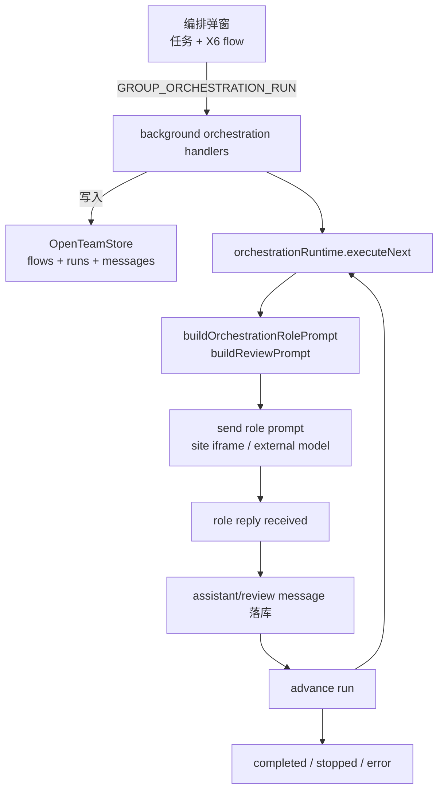

# OpenTeam Agent 编排模式技术方案

## 1. 目标

本文档描述 OpenTeam Agent 编排模式的技术实现方案，对应产品文档：

```text
docs/prd/2026-05-07-agent-orchestration-mode-prd.md
```

本轮技术目标：

- 将普通群聊发送规则从“无 @ 默认全员回复”改为“无 @ 只记录消息，不触发 AI”。
- 新增编排模式入口和编排任务弹窗。
- 使用 AntV X6 实现 Agent 编排画布。
- 支持节点拖拽、连线、并行阶段、审查节点和最大轮数。
- 在 background 中实现编排运行状态机。
- 复用现有 iframe 站点投递链路和外部模型投递链路。
- 让后续节点的 prompt 能看到前置节点输出。
- 让审查节点输出结构化 JSON，系统根据解析结果决定通过、继续下一轮或终止。
- 保持本地优先架构，所有可恢复状态写入 `chrome.storage.local`。

## 2. 当前系统现状

当前系统分三层：

```text
team.html / teamPage
  - 群聊列表、消息流、输入框、人员面板、笔记、弹窗
  - 通过 runtime message 向 background 发送命令

background service worker
  - 读写 chrome.storage.local
  - 维护 runtime frame binding
  - 处理普通消息发送、角色恢复、回复落库
  - 同时支持站点 iframe 角色和外部 API 模型角色

content scripts / external model client
  - 站点 iframe 接收 TEAM_SEND_PROMPT 并回传回复
  - 外部模型通过 background 中的 externalModelClient 调用
```

当前普通消息发送链路：

```mermaid
flowchart LR
  Composer["composerView.submitComposerMessage"] --> BG["GROUP_MESSAGE_SEND"]
  BG --> Parser["parseGroupMentions"]
  Parser --> Targets["targetRoleIds"]
  Targets --> Store["创建 user message<br/>deliveryStatus pending"]
  Store --> Prompt["buildPrompt / buildExternalModelPrompt"]
  Prompt --> Deliver["站点 iframe 或外部模型投递"]
  Deliver --> Reply["TEAM_ROLE_REPLY 或 external response"]
  Reply --> Persist["assistant message 落库"]
```



当前需要改动的关键点：

- `src/group/mentionParser.ts`：无 @ 时当前返回所有角色 ID。
- `src/teamPage/composerView.ts`：输入框提示和预览仍写着“无 @ 默认全员”。
- `src/background/messageHandlers.ts`：`GROUP_MESSAGE_SEND` 当前要求 `targetRoleIds.length > 0`，无目标会报错。
- `src/group/promptBuilder.ts`：当前 prompt 只面向普通单次用户消息，需要新增编排 prompt。
- `src/group/store.ts`：当前 store version 为 `4`，新增编排持久化字段需要升级版本。

## 3. 总体架构

编排模式新增三块能力：

```text
teamPage orchestration UI
  - 编排任务弹窗
  - X6 画布
  - 任务输入、运行设置、审查节点配置
  - 运行状态展示和失败操作

group orchestration domain
  - 类型定义
  - flow 校验
  - X6 graph 与持久化 flow 的转换
  - 编排 prompt 构造
  - 审查 JSON 解析与校验

background orchestration runtime
  - 创建 run
  - 执行步骤
  - 接收回复后推进下一步
  - 审查节点决策
  - 暂停、继续、停止、重试、跳过
```

核心数据流：



关键原则：

- 编排 flow 是配置，run 是一次执行实例。
- 同一群聊第一版同一时间只允许一个 active run。
- 编排运行不绕开现有角色投递能力，而是复用站点 iframe 和外部模型两条链路。
- run 推进发生在 background，UI 只展示状态和发送控制命令。
- 编排 prompt 使用新 builder，不修改普通 `buildPrompt` 的语义。
- 审查节点输出不直接信任，必须解析和校验。
- 达到最大轮数时由系统强制结束，即使审查节点返回 `continue`。

## 4. 依赖选型

### 4.1 AntV X6

新增依赖：

```text
@antv/x6
```

选择理由：

- MIT 协议。
- TypeScript 友好。
- 支持流程图、DAG、节点、边、端口、缩放、平移、选择、键盘删除。
- 不要求引入 React，符合当前 Vite + TypeScript + 原生 DOM 架构。
- 提供 `Addon.Dnd`，适合从左侧人员列表拖节点到画布。

第一版使用范围：

- `Graph` 创建画布。
- 自定义节点形状：人员节点、并行节点、审查节点。
- `Addon.Dnd` 从人员列表拖拽到画布。
- `connecting` 限制连线规则。
- `graph.toJSON()` / 自定义转换函数保存画布草稿。

不在第一版使用：

- 复杂自动布局。
- 任意条件分支。
- 节点内复杂表单渲染。
- 多人协同编辑。

### 4.2 X6 与第一版阶段式模型的关系

虽然使用 X6 展示连线画布，第一版运行时仍建议把图归一化为阶段数组：

```text
第 1 步：A
第 2 步：B + C
第 3 步：D
第 4 步：审查节点
```

原因：

- 第一版产品规则是“上一步全部完成后进入下一步”。
- 阶段数组更容易恢复、测试和执行。
- X6 图可以表达用户心智，运行时不必支持完整自由 DAG。

技术约束：

- 画布可以让用户连线。
- 保存前必须将 X6 graph 校验并转换为线性 stage list。
- 不符合阶段式规则的图，保存或运行时给出明确错误。

## 5. 数据模型

### 5.1 Store 根结构

在 `OpenTeamStore` 新增：

```ts
interface OpenTeamStore {
  orchestrationFlowsById?: Record<string, OrchestrationFlow>
  orchestrationFlowOrderByChatId?: Record<string, string[]>
  orchestrationRunsById?: Record<string, OrchestrationRun>
  activeOrchestrationRunIdByChatId?: Record<string, string>
}
```

`CURRENT_STORE_VERSION` 从 `4` 升级到 `5`。

设计说明：

- flow 需要跨会话持久化，用户可以保存后反复运行。
- run 需要持久化，避免 service worker 暂停或页面刷新后状态丢失。
- active run 按 chat 记录，限制同一群聊同一时间一个运行任务。

### 5.2 Flow 类型

```ts
export type OrchestrationNodeType = 'role' | 'parallel' | 'review'

export interface OrchestrationFlow {
  id: string
  chatId: string
  name: string
  description?: string
  graph: OrchestrationGraphSnapshot
  stages: OrchestrationStage[]
  maxRounds: number
  review?: OrchestrationReviewConfig
  createdAt: number
  updatedAt: number
}

export interface OrchestrationGraphSnapshot {
  x6: unknown
  version: 1
}

export interface OrchestrationStage {
  id: string
  kind: 'roles' | 'review'
  roleIds: string[]
  name?: string
}

export interface OrchestrationReviewConfig {
  reviewerRoleId?: string
  criteria: string
  maxRounds: number
}
```

约束：

- `stages` 是运行时权威结构。
- `graph` 用于 UI 恢复画布。
- `kind: 'roles'` 时 `roleIds` 至少一个。
- `kind: 'review'` 时 `roleIds` 可以为空，表示系统审查员；也可以有一个 `reviewerRoleId`。
- 第一版只允许最多一个审查阶段，且通常放在最后。

### 5.3 Run 类型

```ts
export type OrchestrationRunStatus =
  | 'running'
  | 'paused'
  | 'completed'
  | 'stopped'
  | 'error'

export type OrchestrationStepStatus =
  | 'pending'
  | 'running'
  | 'completed'
  | 'skipped'
  | 'error'

export interface OrchestrationRun {
  id: string
  chatId: string
  flowId: string
  taskMessageId: string
  taskContent: string
  status: OrchestrationRunStatus
  currentRound: number
  maxRounds: number
  currentStageIndex: number
  stageRuns: OrchestrationStageRun[]
  reviewResults: OrchestrationReviewResult[]
  createdAt: number
  updatedAt: number
  completedAt?: number
  error?: string
}

export interface OrchestrationStageRun {
  id: string
  round: number
  stageId: string
  stageIndex: number
  kind: 'roles' | 'review'
  status: OrchestrationStepStatus
  roleRuns: OrchestrationRoleRun[]
  startedAt?: number
  completedAt?: number
  error?: string
}

export interface OrchestrationRoleRun {
  roleId: string
  status: OrchestrationStepStatus
  promptMessageId: string
  replyAttemptId?: string
  replyMessageId?: string
  startedAt?: number
  completedAt?: number
  error?: string
}
```

### 5.4 Review 结果

```ts
export type ReviewDecision = 'pass' | 'continue' | 'stop'

export interface OrchestrationReviewResult {
  round: number
  stageRunId: string
  reviewerRoleId?: string
  messageId: string
  decision: ReviewDecision
  reason: string
  failedCriteria: string[]
  nextRoundInstruction: string
  rawJson: string
}
```

JSON schema 第一版：

```json
{
  "decision": "pass",
  "reason": "string",
  "failedCriteria": ["string"],
  "nextRoundInstruction": "string"
}
```

校验规则：

- `decision` 必须是 `pass | continue | stop`。
- `reason` 必须是非空字符串。
- `failedCriteria` 必须是字符串数组。
- `decision === 'continue'` 时 `nextRoundInstruction` 必须非空。
- 解析失败时审查 stage 标记为 `error`，run 标记为 `error`。

### 5.5 Message 扩展

建议在 `GroupMessage` 上增加可选编排元信息：

```ts
export interface GroupMessage {
  orchestrationRunId?: string
  orchestrationRound?: number
  orchestrationStageId?: string
  orchestrationStageIndex?: number
  orchestrationKind?: 'task' | 'role' | 'review' | 'status'
}
```

用途：

- 消息流展示“第 1 轮 · 第 2 步”。
- 编排 run 查找当前 stage 的回复。
- 失败、重试、跳过时能定位消息。

## 6. 普通群聊发送规则改造

### 6.1 mention parser

`parseGroupMentions` 增加选项：

```ts
export interface ParseGroupMentionsOptions extends RoleMentionLabelOptions {
  defaultTarget?: 'all' | 'none'
}
```

行为：

```text
defaultTarget = all：
  无 @ 返回全部 roleIds

defaultTarget = none：
  无 @ 返回空 targetRoleIds
```

普通群聊新调用使用 `defaultTarget: 'none'`。

为了降低改动风险，可以保留默认值为 `'all'`，只在 `composerView` 和 `messageHandlers` 新路径显式传 `'none'`。测试覆盖后再考虑改默认值。

### 6.2 background 普通消息

`GROUP_MESSAGE_SEND` 对 `targetRoleIds.length === 0` 的处理从抛错改为创建用户消息并直接完成。

无目标消息：

```ts
const userMessage: GroupMessage = {
  type: 'user',
  content: parsed.content,
  targetRoleIds: [],
  mentionedRoleIds: [],
  status: 'received',
  deliveryStatus: {},
}
```

不创建 deliveries，不修改任何 role 为 `thinking`。

### 6.3 composer UI

`composerView` 调整：

- 未输入时提示：`输入消息；@ 人员后触发回复`。
- 输入但无 @ 时预览：`将作为群消息记录，不触发 AI`。
- 无 @ 时不检查人员 ready 状态。
- 有 @ 时按现有逻辑检查目标人员 ready / reconnect / thinking。

### 6.4 @所有人

当前 parser 支持 `@all`。产品文案是 `@所有人`，建议同时支持：

```text
@all
@所有人
```

`mentionMatches` 中增加中文别名。

## 7. 编排 UI 技术方案

### 7.1 新增模块

建议新增：

```text
src/teamPage/orchestrationModalView.ts
src/teamPage/orchestrationCanvas.ts
src/teamPage/orchestrationState.ts
src/teamPage/orchestrationStatusView.ts
src/group/orchestrationTypes.ts
src/group/orchestrationGraph.ts
src/group/orchestrationPrompts.ts
src/group/orchestrationReview.ts
src/background/orchestrationHandlers.ts
src/background/orchestrationRuntime.ts
```

职责：

| 文件 | 职责 |
| --- | --- |
| `orchestrationModalView.ts` | 弹窗 DOM、任务输入、运行设置、保存/运行事件 |
| `orchestrationCanvas.ts` | X6 初始化、节点注册、Dnd、图校验、图转换 |
| `orchestrationState.ts` | UI 草稿状态，当前 flow、选中节点、表单草稿 |
| `orchestrationStatusView.ts` | 群聊顶部或消息区的运行状态条 |
| `orchestrationTypes.ts` | flow/run/review 类型 |
| `orchestrationGraph.ts` | X6 JSON 与 stages 的转换和校验 |
| `orchestrationPrompts.ts` | 编排角色 prompt 和审查 prompt 构造 |
| `orchestrationReview.ts` | 审查 JSON 提取、解析、校验 |
| `orchestrationHandlers.ts` | background runtime routes |
| `orchestrationRuntime.ts` | run 状态机和投递推进 |

### 7.2 X6 初始化

`orchestrationCanvas.ts` 提供：

```ts
export interface OrchestrationCanvas {
  mount(container: HTMLElement): void
  load(flow: OrchestrationFlow | undefined, roles: GroupRole[]): void
  toDraft(): OrchestrationFlowDraft
  validate(): OrchestrationGraphValidationResult
  destroy(): void
}
```

X6 Graph 配置建议：

```ts
new Graph({
  container,
  grid: true,
  panning: true,
  mousewheel: {
    enabled: true,
    modifiers: ['ctrl', 'meta'],
  },
  connecting: {
    snap: true,
    allowBlank: false,
    allowLoop: false,
    allowMulti: false,
    allowNode: false,
    highlight: true,
  },
})
```

第一版连线约束：

- 不允许自环。
- 不允许多个入边表达复杂汇合，除非该汇合能归一化为相邻 stage。
- 不允许从审查节点连到中间节点。
- 审查节点只能作为最后 stage，或最后 stage 后的 gate。

### 7.3 节点设计

节点类型：

```text
role node
  - 单个人员
  - 显示头像、名称、模型来源

parallel node
  - 同一步多个 role
  - 显示多个头像和 “并行发言”

review node
  - 审查节点
  - 显示审查员、最大轮数、审查标准摘要
```

为了降低第一版复杂度，有两种实现方式：

方案 A：

```text
每个人员是一个 X6 节点。
保存时按连线分层，A -> B 和 A -> C 且 B/C -> D 被归一为 A -> B+C -> D。
```

优点：更像自由连线。  
缺点：图归一化和校验复杂。

方案 B：

```text
X6 画布中的每个节点就是一个 stage。
stage 内可以包含一个或多个人员。
```

优点：直接匹配运行模型。  
缺点：不如“每个 Agent 一个节点”直观。

建议第一版采用方案 A 的视觉，但保存前强校验，只接受能归一化为线性 stages 的图。

## 8. 编排运行状态机

### 8.1 Routes

新增 background route：

```text
GROUP_ORCHESTRATION_FLOW_SAVE
GROUP_ORCHESTRATION_FLOW_DELETE
GROUP_ORCHESTRATION_RUN
GROUP_ORCHESTRATION_STOP
GROUP_ORCHESTRATION_RETRY_STAGE
GROUP_ORCHESTRATION_SKIP_STAGE
GROUP_ORCHESTRATION_RETRY_REVIEW
```

后续可加：

```text
GROUP_ORCHESTRATION_PAUSE
GROUP_ORCHESTRATION_RESUME
```

### 8.2 创建 run

`GROUP_ORCHESTRATION_RUN` 输入：

```ts
{
  chatId: string
  flowId?: string
  flowDraft?: OrchestrationFlowDraft
  task: string
}
```

流程：

1. 校验 chat 存在。
2. 校验同一 chat 没有 active run。
3. 校验 task 非空。
4. 保存或更新 flow。
5. 创建用户 task message，`orchestrationKind: 'task'`。
6. 创建 run，状态 `running`。
7. 写入 active run map。
8. 广播 store。
9. 调用 `executeNextStage(runId)`。

### 8.3 执行普通 stage

普通 stage 执行：

1. 读取 run、flow、chat、roles。
2. 创建 stageRun。
3. 对 stage 中每个 role 创建一个内部 prompt message 或 delivery marker。
4. 构造编排 prompt。
5. 复用现有投递能力发送到站点 iframe 或外部模型。
6. 将 role 状态置为 `thinking`。
7. stageRun 状态置为 `running`。

同一 stage 内多个 role 并行投递。

### 8.4 回复后推进

当前 `handleRoleReply` 和外部模型回复落库后，需要通知编排 runtime：

```ts
await maybeAdvanceOrchestrationRun(store, {
  chatId,
  roleId,
  promptMessageId,
  replyMessageId,
})
```

推进规则：

- 找到 active run。
- 找到当前 stageRun 中对应 roleRun。
- 标记 roleRun completed。
- 如果 stageRun 所有 roleRun completed，则 stageRun completed。
- 如果还有下一 stage，则执行下一 stage。
- 如果下一 stage 是 review，则执行审查 stage。
- 如果没有下一 stage 且没有 review 或无需下一轮，则 completed。

### 8.5 审查 stage

审查 stage 可以用两种执行方式：

1. 绑定某个群聊人员作为审核员。
2. 使用系统审查员，通过默认外部模型或当前可用模型执行。

第一版建议优先支持绑定群聊人员作为审核员，避免引入新的“系统模型选择”问题。

审查 prompt 要求：

```text
你是审查节点。
你必须根据审查标准输出合法 JSON。
不要在 JSON 外输出其他内容。
decision 只能是 pass、continue、stop。
```

审查回复落库为 assistant message，`orchestrationKind: 'review'`。

解析结果：

- `pass`：run completed。
- `continue`：若 `currentRound < maxRounds`，`currentRound += 1`，`currentStageIndex = 0`，执行下一轮第一 stage。
- `continue` 且达到最大轮数：run completed，追加系统消息说明达到最大轮数。
- `stop`：run stopped，追加系统状态消息。
- JSON 非法：run error，stage error，等待重试。

## 9. Prompt 构造

### 9.1 角色节点 prompt

新增：

```ts
export function buildOrchestrationRolePrompt(input: BuildOrchestrationRolePromptInput): string
```

输入：

```ts
interface BuildOrchestrationRolePromptInput {
  chat: GroupChat
  role: GroupRole
  roles: GroupRole[]
  task: string
  flow: OrchestrationFlow
  run: OrchestrationRun
  currentStage: OrchestrationStage
  priorMessages: GroupMessage[]
  previousReview?: OrchestrationReviewResult
  includePersona?: boolean
}
```

内容结构：

```text
你正在 OpenTeam 的一个 Agent 编排任务中。

用户任务：
...

流程：
第 1 步：产品经理
第 2 步：工程师、设计师并行发言
第 3 步：审查节点

当前轮次：
第 1 / 3 轮

前置发言：
产品经理：...

上一轮审查意见：
...

你的身份：
...

请以「工程师」身份发言，只输出你的观点。
```

### 9.2 审查节点 prompt

新增：

```ts
export function buildOrchestrationReviewPrompt(input: BuildOrchestrationReviewPromptInput): string
```

要求：

- 明确审查标准。
- 明确最大轮数和当前轮数。
- 明确合法 JSON schema。
- 要求只输出 JSON。

为了处理模型偶尔输出 Markdown code fence，解析器可以兼容：

```text
```json
{ ... }
```
```

但 prompt 中仍要求只输出 JSON。

### 9.3 上下文裁剪

编排上下文可能快速膨胀。第一版沿用 `store.settings.maxContextChars` 做裁剪：

- 优先保留用户原始任务。
- 保留上一轮审查意见。
- 保留当前轮前置 stage 输出。
- 历史轮次早期内容可摘要或截断。

第一版可以先截断，不做自动摘要。外部模型已有 memory 机制，不要在第一版混入编排摘要复杂度。

## 10. 投递复用方案

### 10.1 抽取公共 delivery builder

当前 `handleMessageSend` 内部同时处理：

- role 可用性检查。
- site prompt delivery。
- external model prompt delivery。
- role 状态更新。
- delivery error 标记。

编排 runtime 需要复用这些能力。建议抽取内部 helper：

```ts
createRolePromptDeliveries(input): {
  siteDeliveries: PromptDelivery[]
  externalDeliveries: ExternalPromptDelivery[]
}

sendRolePromptDeliveries(input): Promise<OpenTeamStore>
```

避免复制普通发送逻辑。

### 10.2 编排 prompt message

为了让 stale reply 校验继续生效，每次投递仍需要一个 `promptMessageId`。

方案：

- 创建一条隐藏或普通 user message 作为 prompt anchor。
- 或复用 taskMessageId 并用 `replyAttemptId` 区分。

建议第一版创建普通但可弱展示的 user/system anchor message：

```text
系统：编排第 1 轮第 2 步已发送给 工程师、设计师
```

技术上更简单：

- `role.lastPromptMessageId` 指向真实 message。
- `deliveryStatus` 可以继续按 role 跟踪。
- 现有 stale reply 逻辑可复用。

UI 可把这类 `orchestrationKind: 'status'` 消息折叠展示，避免消息流噪音。

## 11. 失败处理

### 11.1 发送失败

发送失败时：

- roleRun 标记 `error`。
- stageRun 标记 `error`。
- run 标记 `error`。
- role 状态标记 `error`。
- 广播 store。

UI 展示：

```text
工程师发送失败
[重试] [跳过] [停止]
```

### 11.2 回复超时

当前系统已有 stale thinking 概念。编排第一版可以不新增后台 timer，只在 UI 和下一次操作中识别超时。

后续可增加：

```ts
ORCHESTRATION_ROLE_TIMEOUT_MS = 120_000
```

并在 run 状态中展示超时操作。

### 11.3 跳过

跳过 role：

- roleRun 标记 `skipped`。
- 如果 stage 中其他 role 已完成或跳过，则 stage completed。
- 后续 prompt 的前置发言中标注该角色被跳过。

跳过 stage：

- stageRun 标记 `skipped`。
- 直接进入下一 stage。

### 11.4 停止

停止 run：

- run 标记 `stopped`。
- 清理 `activeOrchestrationRunIdByChatId[chatId]`。
- 对当前 thinking roles 调用现有 stop 能力，或至少停止后续推进。
- 已经发送到站点的当前生成不一定能立即中断，后续回复到达时若 run 已 stopped，应作为普通迟到回复处理或标记 ignored。

第一版建议：

- 停止后不再推进后续 stage。
- 尽量复用 `TEAM_STOP_GENERATION` 停止当前站点角色。
- 外部模型通过 `externalModelRuns.abort` 中止。

## 12. UI 状态展示

### 12.1 运行状态条

新增 `orchestrationStatusView`，从 active run 派生：

```text
编排运行中 · 第 1 轮 · 第 2 步 / 共 4 步
当前：工程师、设计师正在发言
等待：反方顾问、审查节点
```

状态来源：

- `store.activeOrchestrationRunIdByChatId[currentChatId]`
- `store.orchestrationRunsById[runId]`
- `store.orchestrationFlowsById[flowId]`

### 12.2 消息流展示

`messagesView` 根据 message orchestration metadata 展示：

```text
产品经理 · 编排 · 第 1 轮 · 第 1 步
```

审查消息展示：

```text
审查节点 · 第 1 轮
结论：继续下一轮
未通过项：...
下一轮重点：...
```

系统状态消息可以使用 `type: 'system'`。

### 12.3 编排弹窗生命周期

弹窗打开：

- 如果当前 chat 有保存 flow，加载最近一个 flow。
- 没有 flow 时创建默认草稿：当前人员按顺序排列，最后可选审查节点。
- 初始化 X6 graph。

弹窗关闭：

- 销毁 X6 graph，释放事件监听。
- 未保存草稿可保存在 `TeamPageState`，不写入 store。

## 13. 校验规则

### 13.1 Flow 保存校验

保存或运行前校验：

- 至少一个普通 role stage。
- 所有 roleId 都属于当前 chat。
- 没有重复不可解释节点。
- 图可归一化为线性 stages。
- 审查节点最多一个。
- 如果设置 maxRounds > 1，必须有审查节点或明确“固定轮数运行”策略。
- maxRounds 范围建议 1 到 5。

### 13.2 X6 graph 归一化

归一化步骤：

1. 从 X6 JSON 读取 nodes 和 edges。
2. 找入度为 0 的起点。
3. 按拓扑层级分组。
4. 每一层转换为一个 stage。
5. 如果某层同时包含 review 和 role，报错。
6. 如果 review 后还有 role，第一版报错。
7. 如果存在无法线性分层的交叉依赖，报错。

示例：

```text
A -> B
A -> C
B -> D
C -> D
```

归一化为：

```text
stage 1: A
stage 2: B + C
stage 3: D
```

## 14. Store 迁移

`CURRENT_STORE_VERSION` 升级到 `5`。

`createDefaultStore` 增加：

```ts
orchestrationFlowsById: {},
orchestrationFlowOrderByChatId: {},
orchestrationRunsById: {},
activeOrchestrationRunIdByChatId: {},
```

`normalizeStore` 增加对应 record normalizer。

`OpenTeamMetaStore` 增加这些字段。由于 flow/run 是跨 chat 的运行状态，第一版建议放在 meta store，不放入单个 chat document：

- flow 可能引用 chat roles，但属于 chat 配置。
- active run 查询需要快速读取。
- run 数量可控制，第一版只保留最近若干 run。

如果后续 run 历史变大，再拆分成独立 storage key。

## 15. 测试策略

### 15.1 单元测试

新增测试：

```text
src/group/orchestrationGraph.test.ts
src/group/orchestrationPrompts.test.ts
src/group/orchestrationReview.test.ts
src/group/mentionParser.test.ts
src/background/orchestrationRuntime.test.ts
src/background/orchestrationHandlers.test.ts
src/teamPage/orchestrationCanvas.test.ts
src/teamPage/orchestrationModalView.test.ts
```

重点覆盖：

- 无 @ 返回空 targets。
- `@所有人` 返回全部 targets。
- 无 @ 普通消息只落库不投递。
- X6 graph 归一化为 stages。
- 非法图给出错误。
- role stage 并行投递。
- stage 完成后推进下一 stage。
- 审查 JSON `pass` 完成 run。
- 审查 JSON `continue` 进入下一轮。
- 达到最大轮数后不继续。
- JSON 非法进入 error。
- stop 后迟到回复不推进 run。

### 15.2 集成测试

扩展 `src/background/groupExperience.test.ts`：

- 创建 chat + roles。
- 保存 flow。
- 运行编排任务。
- 模拟第 1 步回复。
- 验证第 2 步投递。
- 模拟审查节点返回 `continue`。
- 验证进入下一轮。
- 模拟审查节点返回 `pass`。
- 验证 active run 清理。

### 15.3 构建验证

新增依赖后必须跑：

```text
npm run typecheck
npm test
npm run build
```

如果 X6 导致构建体积明显变大，后续可以考虑动态 import：

```ts
const { Graph, Addon } = await import('@antv/x6')
```

编排弹窗打开时再加载 X6，避免影响普通群聊首屏。

## 16. 实施拆分建议

### 阶段 1：普通消息触发规则

- 改 `parseGroupMentions` 支持 `defaultTarget: 'none'`。
- 改 `GROUP_MESSAGE_SEND` 允许无目标消息。
- 改 composer 文案和 ready 检查。
- 补测试。

这一阶段可以独立上线。

### 阶段 2：类型与 Store

- 新增 orchestration 类型。
- 升级 store version。
- 增加 flow/run normalize 和 save。
- 增加 background routes 的空实现和测试。

### 阶段 3：X6 编排弹窗

- 安装 `@antv/x6`。
- 实现弹窗和画布。
- 实现 graph -> stages 校验。
- 支持保存 flow。

### 阶段 4：运行普通 role stage

- 实现 `GROUP_ORCHESTRATION_RUN`。
- 创建 task message 和 run。
- 执行第一个 role stage。
- 回复后推进下一 stage。

### 阶段 5：并行 stage 与失败处理

- 支持同 stage 多 role 并行。
- 支持 stage 部分失败。
- 支持重试、跳过、停止。

### 阶段 6：审查节点和多轮

- 实现审查 prompt。
- 实现 JSON 解析和校验。
- 支持 `pass / continue / stop`。
- 支持最大轮数兜底。

### 阶段 7：体验打磨

- 状态条。
- 消息流编排标签。
- 折叠系统 status message。
- 动态 import X6。
- 日志和错误文案打磨。

## 17. 风险与取舍

### 17.1 X6 自由图与运行模型不一致

风险：用户画出复杂 DAG，但第一版 runtime 只支持阶段式执行。

处理：

- UI 文案明确“第一版按步骤执行”。
- 保存前强校验。
- 非法图提示如何调整。

### 17.2 编排上下文过长

风险：多轮、多角色后 prompt 过长。

处理：

- 第一版按 `maxContextChars` 截断。
- 优先保留任务、上一轮审查意见、当前轮前置输出。
- 后续再做轮次摘要。

### 17.3 Service worker 生命周期

风险：Chrome service worker 可能暂停，run 推进不能依赖内存。

处理：

- run 状态全部写 store。
- 每次回复到达时从 store 恢复 run 状态并推进。
- 不依赖长期 timer。

### 17.4 审查 JSON 不稳定

风险：模型输出 Markdown、解释文字或非法 JSON。

处理：

- prompt 强约束只输出 JSON。
- parser 兼容 code fence。
- schema 校验失败则 run error，允许重试审查。

### 17.5 迟到回复

风险：用户停止 run 后，站点 iframe 仍返回回复。

处理：

- `maybeAdvanceOrchestrationRun` 检查 run status。
- stopped/completed run 不推进。
- 迟到消息可正常落库，但不触发后续 stage。

## 18. 日志与诊断

新增日志事件建议：

```text
orchestration-flow:save
orchestration-run:create
orchestration-stage:start
orchestration-stage:completed
orchestration-stage:error
orchestration-role:deliver
orchestration-role:reply
orchestration-review:received
orchestration-review:parse-failed
orchestration-run:completed
orchestration-run:stopped
```

每条日志至少包含：

- `chatId`
- `runId`
- `flowId`
- `round`
- `stageIndex`
- `roleId` 或 `reviewerRoleId`

## 19. 验收清单

- 普通群聊无 @ 消息不触发 AI。
- 普通群聊 @ 单人、@ 多人、@所有人行为正确。
- 编排弹窗可以打开和关闭。
- X6 画布可以拖入人员节点。
- X6 画布可以连线并保存为 stages。
- 非法图无法运行，并给出错误。
- 运行编排后创建 task message。
- 第一 stage 正确投递。
- 后续 stage 能看到前置 stage 回复。
- 并行 stage 等全部 role 完成后再推进。
- 审查节点能解析合法 JSON。
- `pass` 完成流程。
- `continue` 在未达到最大轮数时进入下一轮。
- 达到最大轮数后强制结束。
- `stop` 终止流程并清理 active run。
- 失败 role 可以重试或跳过。
- 页面刷新后能从 store 恢复 active run 展示。

## 20. 总结

编排模式的技术核心不是画布本身，而是可恢复的运行状态机。X6 负责让用户用直观的方式表达流程；background runtime 负责把可视化流程归一为可执行 stages，并严格控制投递、推进、审查和轮数边界。

第一版应坚持：

```text
X6 负责编辑体验
stages 负责运行模型
background 负责推进
store 负责恢复
JSON schema 负责审查决策
系统规则负责最大轮数和失败边界
```

这样可以在保留“可视化 Agent 编排”产品心智的同时，避免过早落入通用工作流引擎的复杂度。
